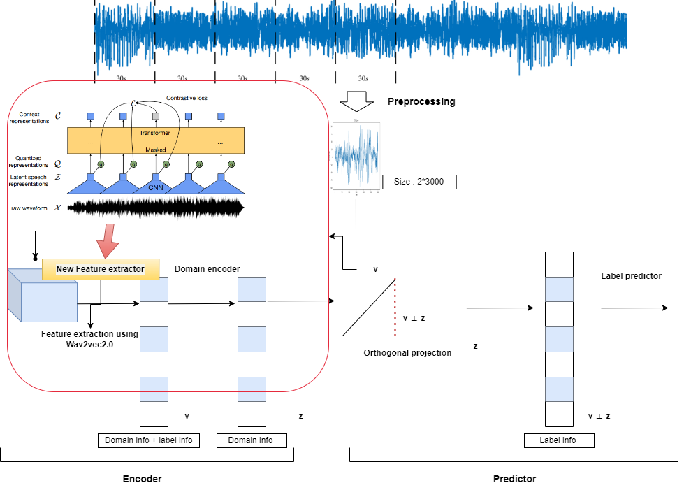

# 2023-1 자기주도연구
- ManyDG: Many-domain Generalization for Healthcare Applications
- wav2vec 2.0: A Framework for Self-Supervised Learning of Speech Representations
- Signal data analysis based on domain generalization

> 5-minute explanation video is provided in [YouTube](https://drive.google.com/file/d/1ovEKEI7WhUgptVu1Gerh2lkKX_HlRGON/view?usp=sharing)




## 1. Folder Tree
- ```data/```
    - ```sleep/```
        - this is the data folder for the processed sample-based Sleep-EDF cassette portion.
        - **sleep_edf_process.py**: the processing file for sleep-edf (using multiprocess package for parallel programming)
        - for downloading the Sleep-EDF data, please refere to https://www.physionet.org/content/sleep-edfx/1.0.0/
- ```log/```, ```pre-trained/```
    - this two folders stores the automatically generated running logs and pre-trained models
- **model.py**
    - this file contains all the backbone and Base models for running the experiments

- ```run_sleep/```
    - **model_sleep.py**: This file inherit the Base model and other model utility functions from **model.py** and support the sleep staging task
    - **run_sleep.py**: This is the entry of sleep stagin task, specifiying the data loader and other initialization steps.
    - **utils_sleep.py**: This file provides the data split and loading files.

## 2. How to run the code
- for sleep staging
``` python
cd ./dg_selfstudy
python data/sleep/sleep_edf_process.py
python run_sleep/util_sleep.py
python run_sleep/model_sleep.py
python run_sleep/run_sleep.py --model dev --cuda 0 --epochs 50
```
- for speech
``` python
cd ./dg_selfstudy
# python data/sleep/sleep_edf_process.py
python run_speech/model.py
python run_speech/util_sleep.py
python run_speech/model_sleep.py
python run_speech/run_sleep.py --model dev --cuda 0 --epochs 50
```

## 3. Result
- https://tensorboard.dev/experiment/Nzm9ZodQQOW6fliklD8SbQ/
- https://tensorboard.dev/experiment/pfBrwtEZS6WszR8qoK7cdA/

## 4. Citation
```bibtex
@inproceedings{yang2023manydg,
    title = {ManyDG: Many-domain Generalization for Healthcare Applications},
    author = {Yang, Chaoqi and Westover, M. Brandon and Sun, Jimeng},
    booktitle = {The 11th International Conference on Learning Representations, {ICLR} 2023},
    year = {2023},
    github = https://github.com/ycq091044/ManyDG
}
```