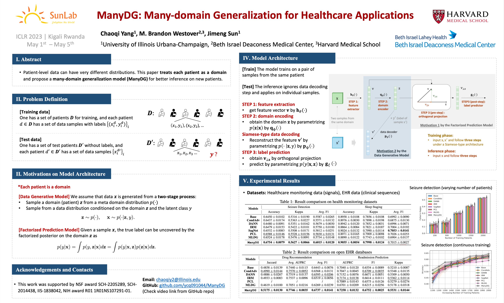

# ICLR'23 ManyDG Paper
- ManyDG: Many-domain Generalization for Healthcare Applications
- Data, Processing Scripts, Baselines and Model Codes
> 15-minute explanation video is provided in [YouTube]
https://www.youtube.com/watch?v=xKOSiauQtwc

<!--  -->

## 1. Folder Tree
- ```data/```
    - ```sleep/```
        - this is the data folder for the processed sample-based Sleep-EDF cassette portion.
        - **sleep_edf_process.py**: the processing file for sleep-edf (using multiprocess package for parallel programming)
        - for downloading the Sleep-EDF data, please refere to https://www.physionet.org/content/sleep-edfx/1.0.0/
- ```log/```, ```pre-trained/```
    - this two folders stores the automatically generated running logs and pre-trained models
- **model.py**
    - this file contains all the backbone and Base models for running the experiments

- ```run_sleep/```
    - **model_sleep.py**: This file inherit the Base model and other model utility functions from **model.py** and support the sleep staging task
    - **run_sleep.py**: This is the entry of sleep stagin task, specifiying the data loader and other initialization steps.
    - **utils_sleep.py**: This file provides the data split and loading files.

## 2. How to run the code
- for seizure detection
``` python
cd ./ManyDG
# obtain the Seizure data first
python run_seizure/run_seizure.py --model [MODEL] --cuda [WHICH GPU] --N_vote [DEFAULT 5] --N_pat [N_OF_PAT] --epochs [EPOCHS]
```
- for sleep staging
``` python
cd ./ManyDG
python data/sleep/sleep_edf_process.py
python run_sleep/run_sleep.py --model [MODEL] --cuda [WHICH GPU] --N_pat [N_OF_PAT] --epochs [EPOCHS]
```

## 3. Citation
```bibtex
@inproceedings{yang2023manydg,
    title = {ManyDG: Many-domain Generalization for Healthcare Applications},
    author = {Yang, Chaoqi and Westover, M. Brandon and Sun, Jimeng},
    booktitle = {The 11th International Conference on Learning Representations, {ICLR} 2023},
    year = {2023}
}
```